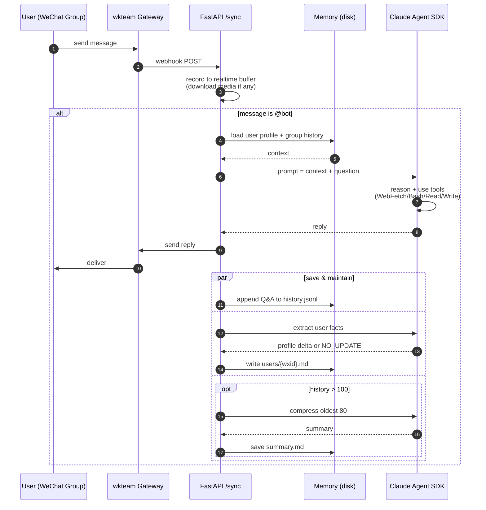

# wechat-ai-bot

> 中文文档：[README.zh-CN.md](README.zh-CN.md)

A WeChat group AI assistant framework powered by [Claude Agent SDK](https://docs.claude.com/en/api/agent-sdk/overview) and [wkteam](https://wkteam.cn) WeChat gateway.

The bot sits in a WeChat group, responds when mentioned (`@bot`), and can:

- Answer questions with full context of recent group messages
- Parse images, files (PPT/Word/Excel via skills), forwarded chat records, quoted replies, and links
- Remember per-user preferences and per-group conversation history across sessions
- Fetch dynamic web content (B站/小红书/etc.) via a headless browser
- Call arbitrary shell commands through Claude's Bash tool for group management (announcements, @all, kick, etc.)

## Architecture



Each `@bot` message triggers a new Agent SDK query. The bot runs in a sandboxed container with Read/Write/Bash/WebFetch/WebSearch tools, and has access to custom skills installed under `.agents/skills/`.

## Memory

Two-tier persistent memory on disk:

**Per-group** (`/memory/groups/{group_id}/`):
- `history.jsonl` — raw Q&A log (appended on each exchange)
- `summary.md` — compressed summary when history > 100 entries; re-compressed when summary > 5000 chars

**Per-user** (`/memory/users/{wxid}.md`):
- Free-text profile maintained by the model itself
- System prompt instructs CC to update this file when it learns something worth remembering (weight, routes, preferences, etc.)
- A forced post-response extraction call catches anything CC missed

## Quick Start

### Prerequisites

- A wkteam account with API credentials and a logged-in WeChat instance
- A public URL that wkteam can reach (use [ngrok](https://ngrok.com) for local dev, or a real ingress in production)
- `ANTHROPIC_API_KEY` from Anthropic Console
- Docker & Docker Compose

### Local development

```bash
git clone https://github.com/<your-org>/wechat-ai-bot.git
cd wechat-ai-bot
cp .env.example .env
# fill in WKTEAM_*, BOT_WCID, ANTHROPIC_API_KEY, ALLOWED_GROUPS

docker compose up --build
```

Expose your local service:

```bash
ngrok http 8000
```

Then register the webhook with wkteam (use their dashboard or call `setHttpCallbackUrl`):

```
https://<ngrok-url>/deploy/sync-api/v1/sync
```

Now `@bot` in one of your `ALLOWED_GROUPS` and verify it responds.

### Production (Kubernetes)

See `k8s/manifest.yaml`. Key requirements:

- Persistent volume mounted at `/project/memory`
- Environment variables from a Secret
- Ingress with TLS pointing to `/deploy/sync-api/v1/sync`

## Configuration

All runtime config is read from environment variables. See `.env.example` for the complete list.

| Variable | Required | Purpose |
|---|---|---|
| `WKTEAM_API_URL` | yes | wkteam gateway endpoint |
| `WKTEAM_TOKEN` | yes | wkteam auth header |
| `WKTEAM_WID` | yes | wkteam WeChat instance id |
| `BOT_WCID` | yes | the bot's own wxid (used for @-mention detection) |
| `ANTHROPIC_API_KEY` | yes | passed to the Claude SDK subprocess |
| `ANTHROPIC_BASE_URL` | no | override for self-hosted or proxy endpoints |
| `ALLOWED_GROUPS` | no | comma-separated chatroom IDs; empty = all |
| `WEBHOOK_SECRET` | no | random string for webhook URL path |

## Customizing behavior

### System prompt

Edit `prompts/system.md` — loaded at startup, no code change required. The prompt defines the bot's persona, boundaries, and tool-use conventions.

### Skills

Skills are installed under `.agents/skills/` and auto-loaded via `setting_sources=["project"]`. To add a skill:

```bash
npx skills add https://github.com/anthropics/skills --skill <name>
```

Skills ship as self-contained folders with a `SKILL.md` describing when and how to trigger them.

### Browser / dynamic web

`scripts/fetch_page.py` uses Playwright to render JS-heavy pages (B站, 小红书, SPA sites) and return plain text. CC can call it through Bash:

```bash
python /project/scripts/fetch_page.py <url>
```

## Project structure

```
wechat-ai-bot/
├── README.md
├── .env.example
├── .gitignore
├── Dockerfile
├── docker-compose.yml
├── requirements.txt
├── app/
│   ├── main.py          # FastAPI webhook + message routing
│   ├── config.py        # env var loading
│   ├── wechat.py        # wkteam API client
│   ├── llm.py           # Claude Agent SDK integration
│   └── memory.py        # two-tier memory system
├── prompts/
│   └── system.md        # the bot's system prompt
├── scripts/
│   └── fetch_page.py    # headless browser helper
├── k8s/
│   └── manifest.yaml    # kubernetes deployment
└── docs/                # design notes, deployment guides
```

## License

MIT
